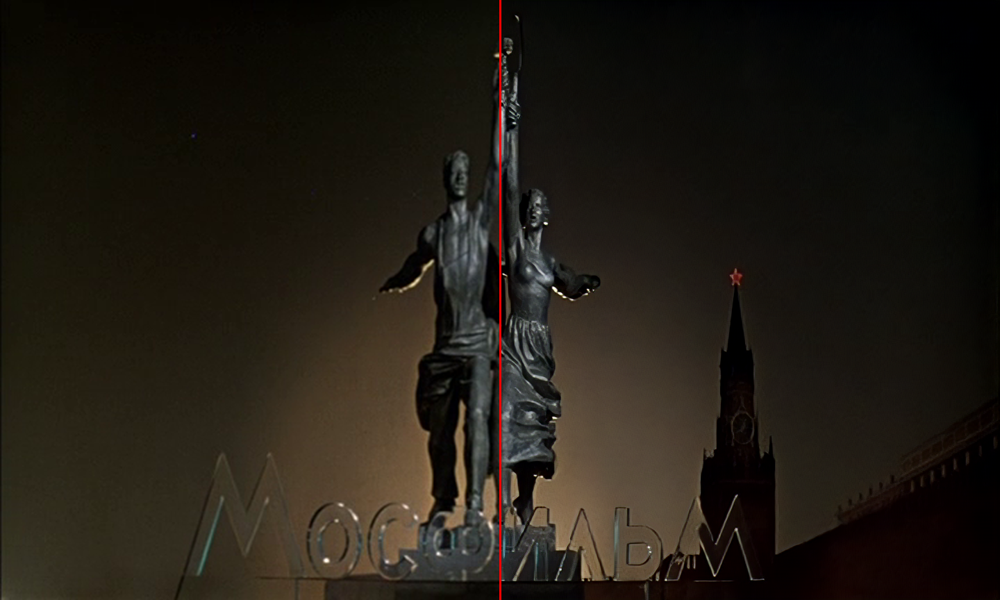
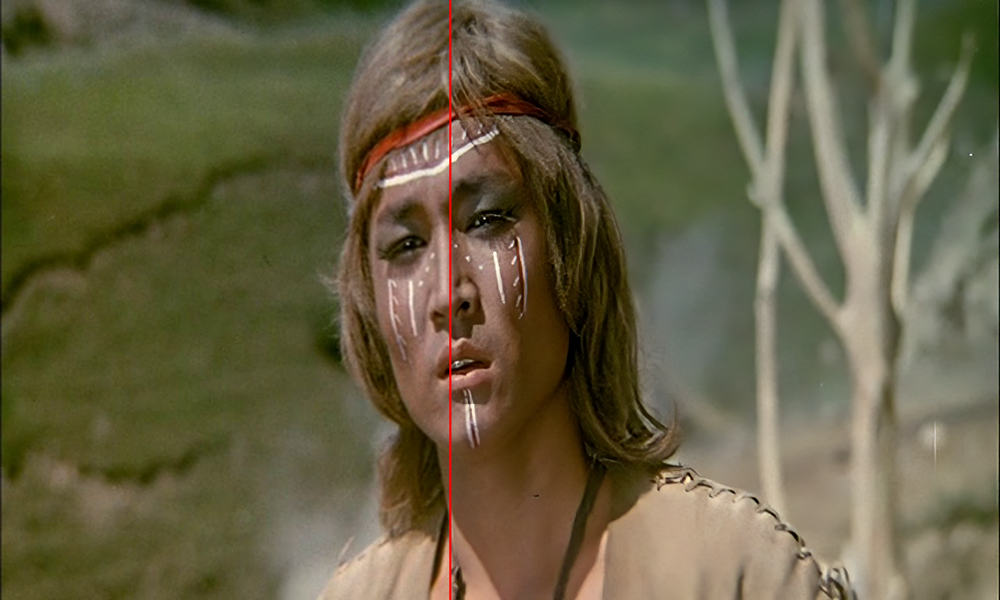
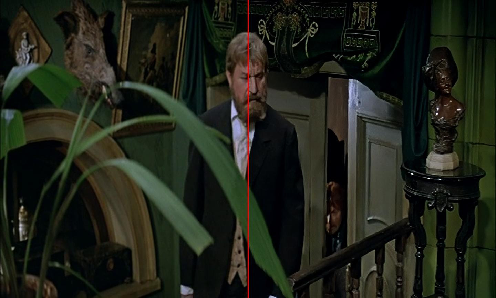
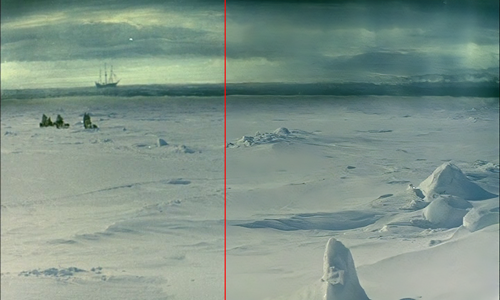
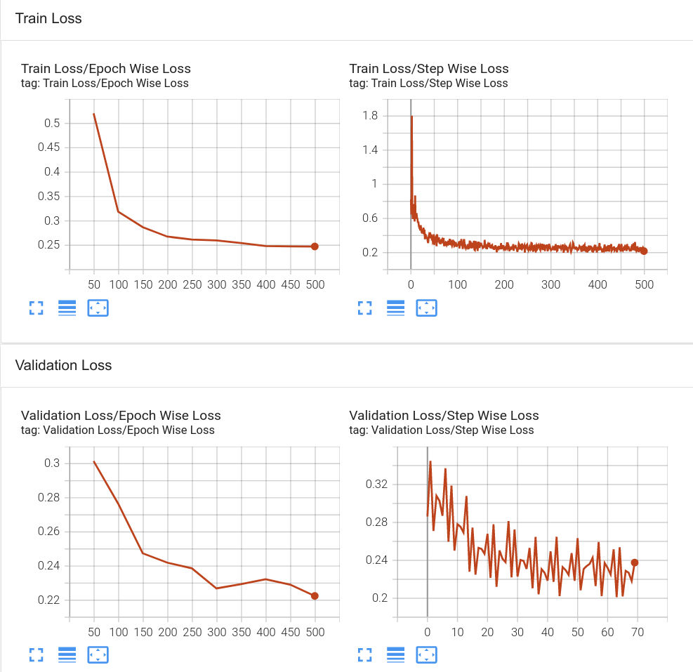
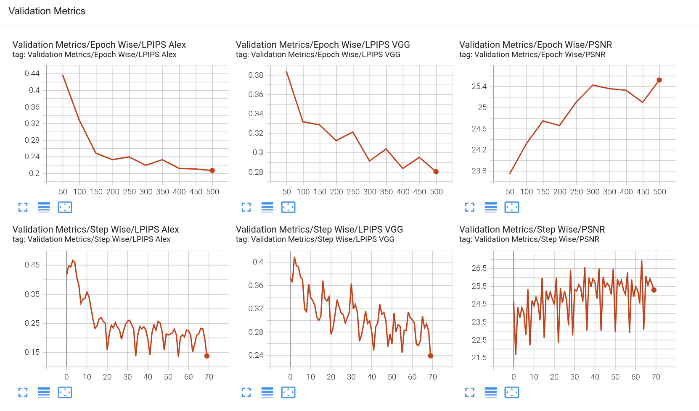
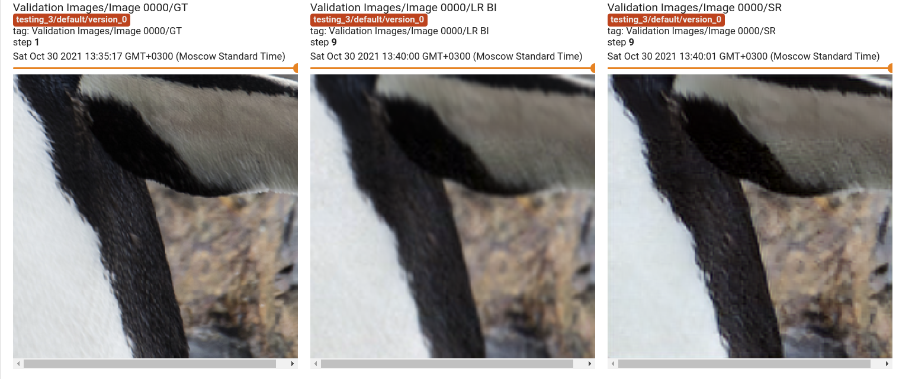

# ModernSR

## Overview
This is a small custom deep learning x2/x4 Video/Image Super Resolution framework that I wrote during my second year at uni, designed to be easy to use and customizable.
You can use it to train, validate, test and inference your Super Resolution models, as well as do a bit of data preparation and data viewing. **NOTE: this framework does not use GANs.**

Below are some examples of bicubic interpolation vs trained model outputs:





## Models
There are several models available for training:
[SR CNN](https://arxiv.org/abs/1501.00092), [SR ResNet](https://arxiv.org/abs/1609.04802), [Residual Dense Network](https://arxiv.org/abs/1802.08797), [Residual in Residual Dense Block](https://arxiv.org/abs/1809.00219). Model code was collected from other repositories and was not created by me (duh!). Recommended architecture is Residual Dense Network.

## LowRes-HighRes Image Pair Creation
To create pair images for training data, you can use several approaches:

- Simplest option: use interpolation to downscale an image. However, it will most likely also be the most useless one. 

- More advanced: use kernels from previously extracted images similar to your target domain ones to create a LowRes image from your HighRes one. To generate the kernels, use the [KernelGAN Repository](https://github.com/sefibk/KernelGAN). The quality will most likely be much better.
- Most advanced: use aforementioned kernels + noise patches extracted from your target domain images to apply noise to LowRes images after downscaling them. Original idea is from [RealSR](https://github.com/Tencent/Real-SR), however, the noise extraction method for this framework was changed to Non-Local Means Denoising. To extract noise images from your target domain images, use the utils/extract_noise.py script.


## Logging 
Tensorboard is used for logging. Below is an example of how a run log works:




## Configs
All training (and optionally inference) information and parameters is stored in and taken from configs.
Configs have the following structure:
```
[General]
scale: 2    # specify Super Resolution scale
epochs: 4   # number of epochs for training
seed: 12    # (optional) seed for deterministic training

[Model]
type: "rdn" # network architecture to be used

[Training]
image_dir: "/path/to/dir"         # path to training images directory
kernel_dir: "/path/to/dir"        # path to training kernels directory
noise_dir: "/path/to/dir"         # path to training noises directory
batch_size: 16                    # train loader batch size
crop: 64                          # image crop size for training
workers: 8                        # train loader workers
learning_rate: 3e-4               # model learning rate
scheduler: {"type": "decay", "gamma": 0.995}                    # (optional) scheduler to be used for training ("decay" and "onecycle" available)
loss: {"type": "perceptual", "vgg_coeff": 0.1, "l1_coeff": 1}   # loss to be used for training ("vgg", "perceptual" and "l1" available)
resume_checkpoint: "/path/to/ckpt"                              # (optional) path to checkpoint to resume interrupted training

[Validation]
image_dir: "/path/to/dir"         # path to validation images directory
kernel_dir: "/path/to/dir"        # path to validation kernels directory
noise_dir: "/path/to/dir"         # path to validation noises directory
batch_size: 16                    # validation loader batch size
crop: 256                         # validation image center crop size
workers: 6                        # validation loader workers

[Test]
image_dir: "/path/to/dir"         # path to test images directory
batch_size: 1                     # test loader batch size
workers: 2                        # test loader workers
log_frequency: 10                 # how often (epoch wise) should test images be logged

[Inference]
checkpoint_path: "/path/to/dir"   # path to checkpoint to be used for inference
in_dir: "/path/to/dir"            # input images directory
out_dir: "/path/to/dir"           # result images directory
workers: 2                        # inference loader workers
batch_size: 1                     # inference loader batchsize

[Logging]
run_dir: "/path/to/dir"           # run log directory
image_log_count: 30               # how many validation images to log each epoch
save_metric: "PSNR"               # metric used for saving checkpoints
save_top_k: 2                     # save best K checkpoints
log_every_n_steps: 1              # log info every N steps
log_metrics: True                 # log metrics to Tensorboard
```

## Training, Validation and Testing
Use the train.py script to train, validate and test your models. To specify all the needed info, configs are used and passed to the script.
You can also resume interrupted training by specifying a resume_checkpoint field in the config \[Training\] section. To perform validation, a \[Validation\] section must be specified. You can also choose to occasionally test the model by specifying the \[Test\] section in the config, which will make the model inference and log test images to Tensorboard. **NOTE: There are some problems with the way Pytorch-Lightning logs validation after resuming, so you can expect a fix either from me or from them soon.**
```
python3 train.py example_config.cfg
```

## Inference
Use the inference.py script to upscale and save images using a trained model. You can either pass a config with an inference section or specify all required arguments through the command line. **NOTE: Keep in mind that these models are quite big, so you will require a beefy GPU with enough VRAM to inference faster. Otherwise, you'll have to use a CPU, which is significantly slower.**
```
sage: inference.py [-h] [--config CONFIG] [--in_dir IN_DIR]
                    [--out_dir OUT_DIR] [--workers WORKERS]
                    [--batch_size BATCH_SIZE] [--scale SCALE]
                    [--checkpoint_path CHECKPOINT_PATH] [--model MODEL]

optional arguments:
  -h, --help            show this help message and exit
  --config CONFIG       Config file for training Super Resolution models.
  --in_dir IN_DIR       Input inference image directory.
  --out_dir OUT_DIR     Inference results directory.
  --workers WORKERS     Number of workers for loading inference dataset.
  --batch_size BATCH_SIZE
                        Batch size of inference data loader.
  --scale SCALE         Super Resolution scale of the model.
  --checkpoint_path CHECKPOINT_PATH
                        Path to checkpoint to be used for inference.
  --model MODEL         Model type to be used for inference.
```

## Helper Scripts
There are several helper scripts available to make the framework easier to use.
### concat_videos.py
This script allows you to concatenate two videos together vertically or horizontally (passed as a parameter). You can use it to compare the effectiveness of the models used to create the videos.
```
usage: concat_videos.py [-h] [--stack {h,v}] vid1 vid2

positional arguments:
  vid1           First video.
  vid2           Second video.

optional arguments:
  -h, --help     show this help message and exit
  --stack {h,v}  Stack videos vertically or horizontally.
```
### extract_noise.py
This script extracts noise from images that you can use for training your models. Alternatively, you can use it to get denoised images.
```
usage: extract_noise.py [-h] [--src_dir SRC_DIR] [--dest_dir DEST_DIR]
                        [--noise_level NOISE_LEVEL]
                        [--window_size WINDOW_SIZE]
                        [--blur_kernel_size BLUR_KERNEL_SIZE]
                        [--operation OPERATION]

optional arguments:
  -h, --help            show this help message and exit
  --src_dir SRC_DIR     Image directory from which content is to be used.
  --dest_dir DEST_DIR   Directory in which to save the results.
  --noise_level NOISE_LEVEL
                        How strong extracted noise should be.
  --window_size WINDOW_SIZE
                        Size of window to be used for computing average.
  --blur_kernel_size BLUR_KERNEL_SIZE
                        Size of blur kernel to be used.
  --operation OPERATION
                        Operation to be done: extract noise or denoise images.
```

### make_video_dataset.py
This script allows you to create a dataset from a video or a movie by sampling and saving frames with a given frequency.
```
usage: make_film_dataset.py [-h] [--prefix PREFIX] src_path dest_dir frequency

positional arguments:
  src_path         Path to film video to be used.
  dest_dir         Directory in which results are to be saved.
  frequency        How often (in frames) a frame should be saved.

optional arguments:
  -h, --help       show this help message and exit
  --prefix PREFIX  Image prefix.
```

### split_train_val.py
This script allows you to easily split a data folder into train and validation folders with a given train share. 
Example: image_dir/ --> image_dir/train/, image_dir/valid/
```
usage: split_train_val.py [-h] [--recursive] src_dir train_share

positional arguments:
  src_dir      Noise or kernels to be moved
  train_share  Percentage of files to be used for training

optional arguments:
  -h, --help   show this help message and exit
  --recursive  Choose to split only files in specified directory or all subdirectories as well.
```

### visualize_kernels.py
This script allows you to visualize extracted image kernels for analysis or filtering.
```
usage: visualize_kernels.py [-h] src_dir dest_dir

positional arguments:
  src_dir     Source kernels directory to be used.
  dest_dir    Directory in which resulting images are to be put.

optional arguments:
  -h, --help  show this help message and exit
```


### inference_video.py
This script allows you to apply a trained model to a video.
**NOTE: INFERENCING EVEN A SMALL (500 x 500) VIDEO REQUIRES A LOT OF VRAM. If inferencing fails, try to use a CPU (but it will take a lot longer!)**
```
usage: inference_video.py [-h] --video_path VIDEO_PATH
                          [--compression_level COMPRESSION_LEVEL] --net_type
                          NET_TYPE --checkpoint_path CHECKPOINT_PATH --scale
                          SCALE --save_name SAVE_NAME

optional arguments:
  -h, --help            show this help message and exit
  --video_path VIDEO_PATH
                        Path to movie file to be inferenced.
  --compression_level COMPRESSION_LEVEL
                        Resulting video compression level.
  --net_type NET_TYPE   Model type to be loaded for inference.
  --checkpoint_path CHECKPOINT_PATH
                        Path to model checkpoint to be used for inference.
  --scale SCALE         Scale of the inference model.
  --save_name SAVE_NAME
                        Save name of the resulting video.
```
